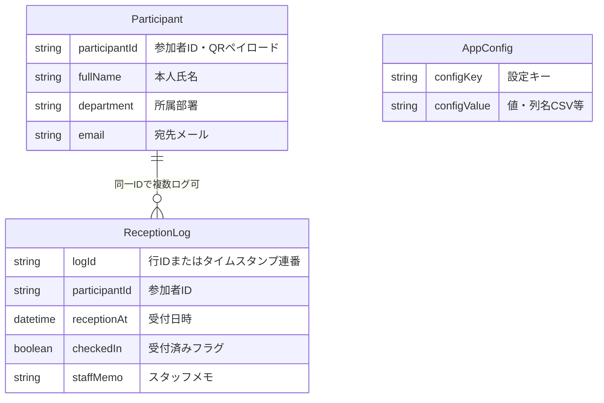
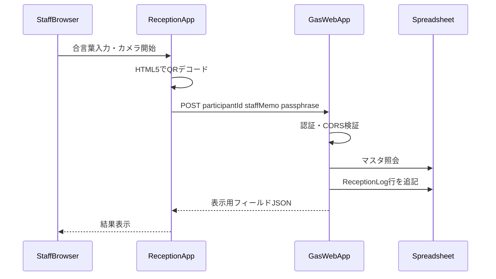
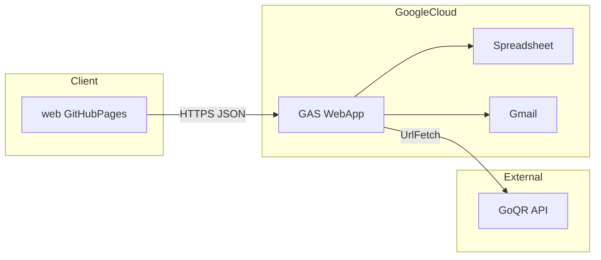

# アーキテクチャ設計書

## 1. 文書の目的

本書は、QR コード受付システムにおける **データの論理構造** と **バックエンド（Google スプレッドシート / GAS）とフロントエンド（QR 読取・HTTP クライアント）の関係** を示す。根拠は [要件定義書](./要件定義書.md) および [リポジトリ構造定義書](./リポジトリ構造定義書.md) とする。

## 2. システムコンテキスト

- **参加者**: メールで受け取った QR（参加者 ID のみ）を提示する。
- **受付スタッフ**: GitHub Pages 上の Web アプリを開き、簡易認証後、カメラで QR を読み取る。
- **管理者**: GAS でスプレッドシート初期化・メール下書き・一斉送信を行う。
- **外部**: **GoQR API**（QR 画像生成）は GAS から `UrlFetchApp` 等で呼び出す。ブラウザから直接呼ばない。

データの正は **Google スプレッドシート** に置き、**GAS** がシート操作・Gmail・Web API を担う。**受付フロント**は静的サイトであり、スプレッドシートには **GAS Web アプリ経由**でのみ書き込む。

## 3. 論理データモデル（ER 図）

以下は **リレーショナル DB ではなく**、スプレッドシート上のシート行を **論理エンティティ** として表した図である。

### 3.1 エンティティの対応関係

| 論理エンティティ | スプレッドシート上の想定 |
|------------------|-------------------------|
| `Participant` | 参加者マスタシートの 1 行 |
| `ReceptionLog` | 受付ログシートの 1 行（再スキャンごとに行追加） |
| `AppConfig` | 設定シートまたは命名範囲（表示列・運用フラグ等。実装で確定） |

### 3.2 QR ペイロードと紐づけ

- QR にエンコードされるのは **参加者 ID 文字列のみ**（[要件定義書 §6](./要件定義書.md)）。
- フロントがデコードした文字列は `Participant.participantId` と **一致する行**をマスタから参照し、その参加者に対する `ReceptionLog` を **新規行として追加**する。

## 4. 処理フロー（受付時）

ER 図だけでは「カメラ〜HTTP」の流れが読み取りにくいため、受付時の **シーケンス** を示す。

## 5. コンポーネント関係（概要）

- **メール送信・QR 添付フロー**（事前）: GAS がマスタを読み、GoQR で画像取得後、Gmail に下書き／送信。フロントは関与しない。
- **受付フロー**（当日）: `Web` が QR から ID を得て `GASrv` に送り、`SS` のログを更新する。

## 6. 非機能・境界

- **CORS**: GAS Web アプリが `Access-Control-Allow-Origin` を GitHub Pages のオリジンに合わせて返す（詳細は [API設計書](./API設計書.md)）。
- **認証**: フロントから送る **合言葉** により、Web API の無制限利用を抑止（[要件定義書 §7.3](./要件定義書.md)）。

## 7. 関連文書

- [要件定義書](./要件定義書.md)
- [リポジトリ構造定義書](./リポジトリ構造定義書.md)
- [API設計書](./API設計書.md)

## 8. 改訂履歴

| 版 | 日付 | 内容 |
|----|------|------|
| 0.1 | 2026-03-28 | 初版 |
